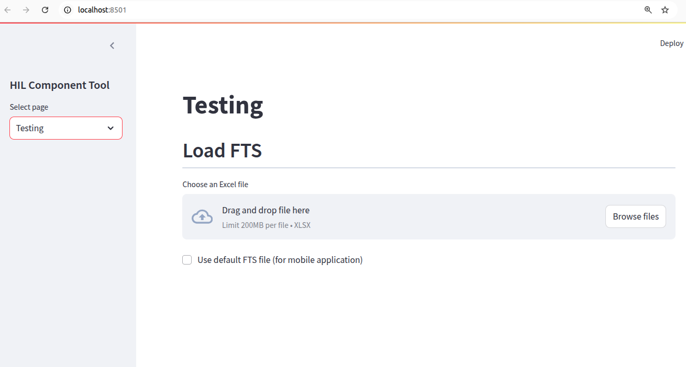
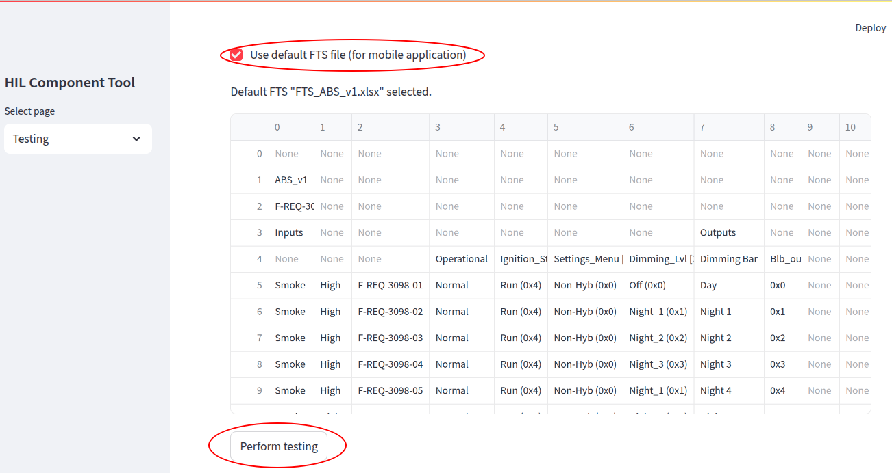
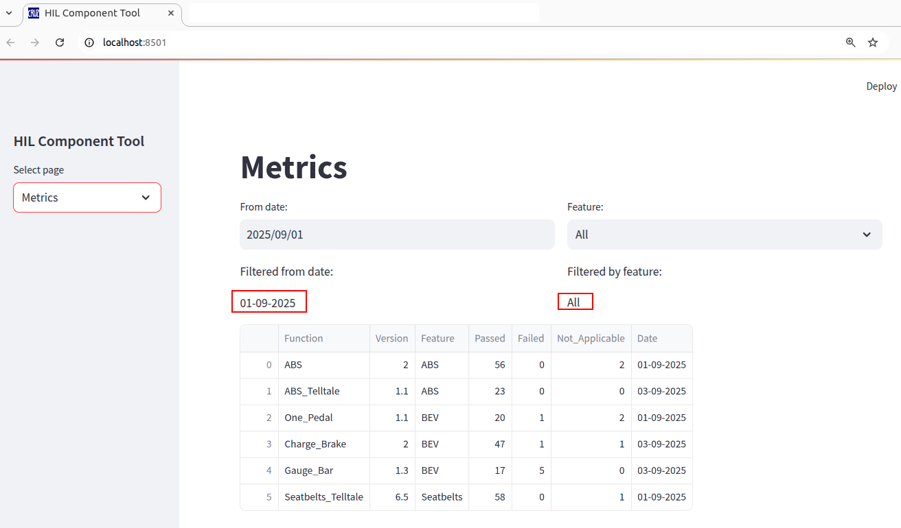

# Testing-and-Visualization
This repository contains the Testing-and-Visualization project deployed on a web server (render.com) with the following link:


This project is used to both perform testing and display some graphics to inform about the testing results. There are two pages:

-In page "Testing", it is possible to select the xlsx file to perform testing (fig. 1) and then a report is generated automatically including a pie plot (fig. 2). It is posssible to make changes in the report and the pie plot will be updated automatically.




-In page "Metrics", all information about testing progress is obtain by setting two filters (by date and by feature). It is not possible to make changes in the results. A bar plot is used to show the total performed TestCases and every bar corresponds to every feature tested.



## 🚀 How to run locally
1. Clone this repository:
```
git clone https://github.com/arteaga7/Testing-and-Visualization.git
```
2. Set virtual environment and install dependencies:
```
python3 -m venv env
source env/bin/activate
pip3 install -r requirements.txt
```
3. Run app.py:
```
streamlit run app.py
```