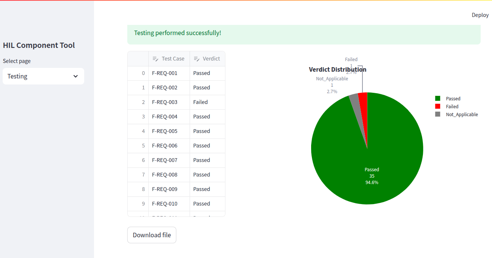

# Testing-and-Visualization
This repository contains the Testing-and-Visualization project deployed on a web server (render.com) with the following link:

https://testing-and-visualization.onrender.com/

## Overview
This project is used to both perform testing and display some graphics to inform about the testing results. There are two pages:

-In page "Testing", it is possible to select the xlsx file to perform testing or to use a default FTS file by checking the checkbox "Use default FTS file (for mobile application)" (fig. 1). By clicking on "Perform testing" (fig. 2), a report is generated automatically including a pie plot (fig. 3). It is possible to make changes in the report and the pie plot will be updated automatically.

Fig. 1.

Fig. 2.

Fig. 3.

-In page "Metrics", all information about testing progress is obtained by setting two filters, by date and by feature (fig. 4). It is not possible to make changes in the results. A bar plot is used to show the total performed TestCases and every bar corresponds to every feature tested (fig. 5).

Fig. 4.

Fig. 5.

## 🚀 How to run locally
1. Clone this repository:
```
git clone https://github.com/arteaga7/Testing-and-Visualization.git
```
2. Set virtual environment and install dependencies:
```
python3 -m venv env
source env/bin/activate
pip3 install -r requirements.txt
```
3. Run app.py:
```
streamlit run app.py
```
